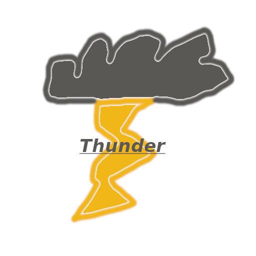
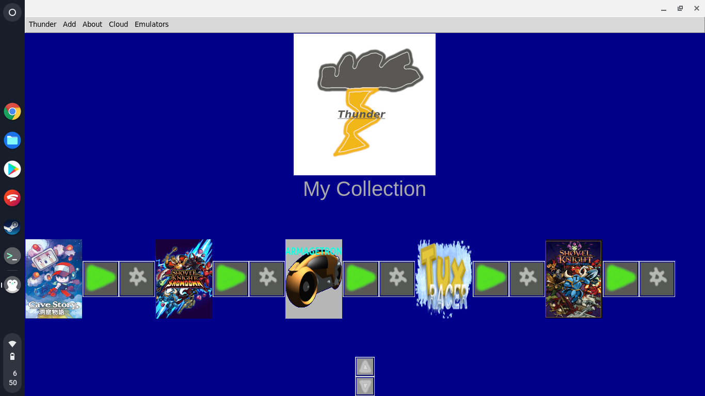

# Thunder
## Gaming on ARM, made easy
----

Installing
----

> View help for Thunder [here](HELP.md)

First make sure your system meets the requirements listed below:
#### Minimum:
- CPU: `Quad-Core ARM Cortex-A53, 1.4Ghz or faster recommended`
- RAM: `1GB, 2GB is better`
- GPU: `Any reasonably good GPU for simpler 2D graphics`
- OS: `Any 32-bit Debian-Based Linux Distro, or ChromeOS`
- Storage: `microSD or eMMC with 32GB or more storage`
- Additional Notes: `Heatsink and/or fan recommended`
- Example of Compatable Device: `Raspberry Pi 3B+, many Chromebooks`
#### Recommended:
- CPU: `Quad-Core ARM Cortex-A72 (A72+A53 as well), 1.8Ghz or faster recommended`
- RAM: `4GB, 8GB is better`
- GPU: `Any reasonably good GPU capable of running most 2D and some 3D`
- OS: `Any 64-bit Debian-Based Linux Distro, or ChromeOS`
- Storage: `microSD, eMMC, or SSD with 64GB or more storage`
- Additional Notes: `Heatsink and fan recommended`
- Example of Compatable Device: `Raspberry Pi 4B 8GB, RockPi 4B+ 4GB, many Chromebooks`

Thunder may work on devices that do not meet these requirements, however this is what we recommend. The "Minimum" are for running retro games in emulators, and very lightweight PC games, and the "Recommended" are for running retro games up to the Wii, 2D PC games, and some 3D PC games.

These are the operating systems Thunder is regularly tested on:

- Ubuntu Desktop 21.04 (Raspberry Pi)
- ChromeOS*
- TwisterOS Armbian

###### *You may still encounter bugs on these operating system(s).

These operating systems Thunder supports but isn't regularly tested on:

- Raspberry Pi OS 32-bit and 64-bit

----

As installing Box86, Box64, Steam, and Mednafen would be complicated, we made an easy-to-use setup script.

### Debian/Ubuntu based distros
<b>IMPORTANT</b>: Currently Thunder only supports Pi4, Pi3, and RK3399. SD845 is compatible as well, but isn't tested. More platforms are planned.
```
cd ~; git clone https://github.com/hadcl4/Thunder
```
If you have `gh` installed, you can run this instead of the command above. But don't run both!:
```
cd ~; gh repo clone hadcl4/Thunder
```
Then run this to start the setup:
```
cd Thunder && chmod +x setup && ./setup
```
Then you'll be asked several questions about what software you want Thunder to install (Steam, Mednafen, Box86, etc.). Once the software is installed or is skipped, Thunder will do some basic setup and then ask you if you want to reset your configs. This is required on first time setup, however afterwards we don't recommend doing it again. After that, Thunder will install dependencies. Once dependency installation is complete, you're ready to start using Thunder!

----

### ChromeOS
On ChromeOS you'll first need to activate a Linux development environment. Head to Settings -> Developers -> Linux Development Environment, then activate. ChromeOS will then download a minimal Debian installation. Before cloning Thunder, run `sudo apt update && sudo apt upgrade`. Also, because ChromeOS' Debian environment is very minimal, you'll also need to install nano (`sudo apt install nano`). Now there's one final step before we install Thunder: installing another terminal emulator and changing `x-terminal-emulator` to that terminal. Just for example, install `gnome-terminal` using `sudo apt install gnome-terminal`. After that run `sudo nano /usr/bin/x-terminal-emulator`, comment out the line to launch ChromeOS' terminal, and below that put `exec /usr/bin/gnome-terminal "$@"`. After you have updated and installed nano, and installed another terminal emulator, exit your development environment, and head back to the settings for your development environment. Adjust the size to approximately 12GB. This will give enough room for Thunder, Steam, Box86, Box64, and a several games. After you've adjusted, follow the steps listed for Debian/Ubuntu based distros.

Now you can play all your PC games portably, without an expensive and heavy gaming laptop!

###### Thunder running on a Chromebook

----

### Non Ubuntu/Debian based distros
Not yet tested. However if you have `apt`, a way to use `.deb`s, and Python, Thunder should work.

----

### Non-ARM, Non-Linux
<b>NOT OFFICIALLY SUPPORTED</b>. You will very likely encounter bugs, especially on Non-Linux operating systems. You may be able to hack Thunder to work on x86/x64 Linux, however functionality will still be limited.

----

About
----

> View Thunder's license [here](LICENSE.md)

> View Thunder's changelog [here](CHANGELOG.md)

ARM PCs are amazing. They're small. They're quick. They don't need much power. But... well, there's not many games that natively run on them due to needing an x86 processor. Well, in more recent years, that's changed. Windows has x86 emulation, MacOS has Rosetta 2, and Linux has Box86. The emulation has gotten better, and faster. ARM PCs now have just as quick of performance as x86 PCs, but in a much smaller form factor. ARM PCs are the future, but companies such as Valve haven't made ARM versions of their gaming clients. Well, Thunder is here to change that on Linux platforms. It aims to be a drop-in replacement for Steam, GOG, Itch, and other gaming services, but on ARM devices, allowing you to run x86 games on them. It uses Box86 and Box64 for emulation of an x86 processor, puts your games in a single place, and makes it really easy to run them. You may be wondering though, why not not just use Box86 and Box64 normally? And how is it easier? Well, here it goes:
#### Thunder uses user-made setup scripts that make running games really easy, and in many cases will get the best performance possible.
It has a built-in database of cover art, so you can easily fetch covers from there.
That way your collection looks really nice, like it's your shelf that you keep your games on. Also Thunder makes retro gaming easy as well. When making Thunder I originally was going to use libretro cores, but I decided in the end to use Mednafen. It's a multi-system emulator that runs just about any retro game from the Saturn/PlayStation era or older. And it's command line based, which means a normal user probably wouldn't use it, but Thunder lets you run your retro games from it's user-friendly GUI. And cover art will also be included for them. That means you have just one place you need to go to to play all your retro and PC games, made user-friendly and simple. The target of Thunder is to bring awareness of ARM as a viable gaming platform, and make running games really simple and easy.

Thunder isn't just limited to what I've made directly for it either. I've included a <b>preconfigured Dolphin</b> where many games are playable (usually above 30FPS on 1.8Ghz Pi4s, many games over 40FPS), <b>melonDS with hardware acceleration</b> so most games run at 50-60FPS called melonDS_Pi, and a <b>custom Mednafen frontend</b> that is very lightweight and easy to use (and I made the frontend myself!) called Mednagui. I also have included plain PCSX Reloaded (fetched from the PiOS Buster Repo) and PPSSPP (from Pi-Apps) without any modifications.

Thunder also features a storefront for downloading free and open-source games. Games such as Armagetron Advanced and Teeworlds are featured in there.

So in the end Thunder is really a combination of a game launcher, an app store, a collection of scripts to get good performance in games, and a bundle of emulators.

----

Getting Games
----

You're probably wondering how you get games in Thunder. Well, unlike the many, many other gaming services out there, Thunder lets you choose where you get your games from. Whether it's from those old CD-ROMs with your favorite PC classics, modern games from Steam, GOG, or Itch, or even a few games available in Thunder's own storefront. With Thunder, it's your choice. If you want games you know for sure will work, Thunder's built-in ThunderStore has a few games tested carefully even on high settings. But if you want to play all the latest, greatest games, Steam, Itch, GOG, etc. will be your best options. You can even run games in Thunder through emulators and cloud-gaming services like Stadia! So, no matter what, Thunder gives you the *freedom* to choose where you get games from. Better for you, the companies that own the storefronts (they get the money), and us developers (we won't have to make a large store ourselves)!

----

Credits
----
Thunder was programmed by Hadcl4.
Thunder makes use of the following projects. Without these it wouldn't be possible:

- Box86 and Box64
- Mednafen
- Some of the Pi-Apps install scripts
- Various emulators such as Dolphin and melonDS.

Thunder was created using software listed below:

- VSCodium (coding and error-checking)
- GIMP (Thunder logo, as well as icons for buttons)
- `markdown` (Generating HTML docs)

----

For Developers
----
> View how to make sources for Thunder [here](SOURCES.md)

> View Thunder's directory structure [here](Directory_Structure.md)

Thunder is mainly made of a single file: [main.py](main.py), because of that you will need to know Python to contribute. It's a rather simple language, so it should be quick to learn. Or, if you don't know Python, but know BASH, you can still contribute! The /database folder contains setup scripts for games, and covers. If you know enough BASH to make a setup script for a game, or are at least able to upload a game cover, you can contribute to Thunder. Also the [start](start) file contains the script to launch Thunder. And also, the [setup](setup) file contains the installation scripts. There also are some extra files such as [scp](scp.py) that manage additional features, like in scp's case file transfer. The script [thunder-cli](thunder-cli) manages many parts of the GUI (setup scripts, system info, etc.) and can be run from the terminal. The /runtime folder contains various extra scripts. For example "startup" runs when Thunder starts up and downloads from GitHub the latest news about Thunder. Finally, there's the /emulators folder containing various emulators with extra scripts to get the best performance possible. And that's about all, the rest is described in the files themselves.

Thunder stores its configuration in a subdirectory of the home folder: `.thunder`. The `.thunder` folder contains the following:
- `library.cfg`
- `config.cfg`
- `configs`
- `page.cfg`

The `library.cfg` file keeps track of your library, in other words what games you have in Thunder.

The `config.cfg` file tells Thunder what theme to use.

The `configs` folder contains individual configs for each game, for example if a game needs a special environment variable to function properly or needs you to fake a higher profile OpenGL to run. Just know this feature isn't available yet, and is being tracked at issue #1 (UPDATE: As of commit e2f868a, you can now configure games individually using cartridges).

The `page.cfg` file keeps track of if you want Thunder to be fullscreen or not.

For development, we recommend using `thunder-cli --dev`, which will startup Thunder in Devmode.

----

Emulators
----
Please see [emulators/README.md](emulators/README.md) for info about the various emulators included with Thunder (if they require a 64-bit OS or not, what platform they emulate, what's changed with the version included, etc.).

----

Notes about Pi Zero 2 W Boards
----
Currently Thunder is not officially supported on Pi Zero 2 W boards due to them only having 512MB RAM. Thunder can technically <i>run</i> on Z2W boards, the problem is that not many <i>games</i> run on the board. If you still want to use Thunder on a Z2W (like for a game server), you might be able to compile Box86 with Pi3 as the target because Z2W and the Pi3 are so similar. But as we said before, this is might not work and even if it does we don't recommend doing it.

----

Final Note
----
Thunder is a large application and many parts of it still are missing certain features (such as how several emulators are missing ARMHF versions). Contributions are welcome!

Also, if you find any bugs, please report them! I want to make Thunder the best way to play games on ARM Linux, so knowing what needs fixed really helps me! Feature requests are welcome too.

----

###### Thunder is not in any way associated with Valve (and because of that, Steam), GOG, Itch, or any other mentioned storefronts or companies. Thunder is also not associated with the creators of any games featured in the store or the database. Thunder is not associated with the creators of any emulators included.

----
